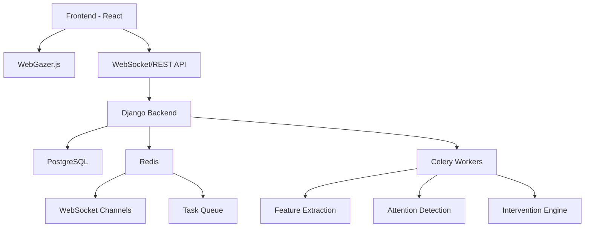

# RankCatalyst – Attention-Aware ITS (JEE Chemistry)

Dark-themed, production-ready mono-repo with React + Vite + TS + Tailwind (frontend) and Django REST + JWT (backend), wired via Docker and PostgreSQL. Now featuring **real-time gaze tracking** and **adaptive interventions** for personalized learning experiences.

## 🎯 What's New (Weeks 3-4)

### Gaze Tracking System
- **WebGazer.js Integration**: Real-time eye tracking with 9-point calibration
- **Attention Detection**: Heuristic-based detection of on-task, inattention, confusion, and fatigue states
- **Adaptive Interventions**: Rule-based system that provides hints, difficulty adjustments, and focus nudges
- **Privacy-First**: No video storage, only normalized gaze coordinates and derived features
- **Offline-Safe**: Browser-based gaze buffering with automatic flush on reconnect

### Technical Features
- **WebSocket Support**: Real-time gaze data streaming with fallback to REST API
- **Feature Extraction**: Rolling window analysis with fixation detection, saccade analysis, and zone mapping
- **Background Processing**: Celery-based pipeline for feature extraction and attention detection
- **Comprehensive Analytics**: Session dashboards with timeline visualization and export capabilities

## 🏗️ Architecture



## 🛠️ Stack
- **Frontend**: Vite + React + TypeScript + TailwindCSS, Zustand, React Hook Form, Zod, WebGazer.js, Recharts
- **Backend**: Django + DRF + SimpleJWT, PostgreSQL, Redis, Channels, Celery, NumPy, Pandas
- **Tooling**: ESLint/Prettier, Black/isort/Ruff/mypy, pytest, Jest/RTL
- **Docker services**: frontend, backend, db, redis, celery, celery-beat

## 🚀 Getting Started

### Prerequisites
- Docker Desktop
- Node 20 and Python 3.12 are optional (only if running outside Docker)
- **Camera access** for gaze tracking (Chrome/Firefox recommended)

### Quick Setup
1. **Clone and setup environment**
   ```bash
   git clone <repository>
   cd RankCatalyst
   cp backend/.env.example backend/.env
   ```

2. **Start all services**
   ```bash
   make up
   # or: docker compose up -d --build
   ```

3. **Initialize database**
   ```bash
   make migrate
   make superuser  # optional
   ```

4. **Access the application**
   - Frontend: http://localhost:5173
   - Backend API: http://localhost:8000
   - Admin: http://localhost:8000/admin

### 🎯 Starting a Gaze Session
1. **Login** to the application
2. **Navigate** to Dashboard → "Start Gaze Session"
3. **Allow camera access** when prompted
4. **Complete calibration** by looking at 9 points for 500ms each
5. **Begin learning** with real-time attention monitoring

## ⚙️ Environment Configuration

### Backend Environment Variables
```bash
# Django Settings
DJANGO_SECRET_KEY=your-secret-key-here
DJANGO_DEBUG=True
DJANGO_ALLOWED_HOSTS=localhost,127.0.0.1
DJANGO_SETTINGS_MODULE=rankcatalyst.settings.dev

# Database
POSTGRES_DB=rankcatalyst
POSTGRES_USER=rank_user
POSTGRES_PASSWORD=rank_pass
POSTGRES_HOST=db
POSTGRES_PORT=5432

# Redis & Celery
REDIS_URL=redis://redis:6379/0
CELERY_BROKER_URL=redis://redis:6379/1
CELERY_RESULT_BACKEND=redis://redis:6379/2

# Gaze Tracking Configuration
GAZE_SAMPLE_MAX_HZ=60
GAZE_BATCH_MS=300
ATTENTION_MIN_CONF=0.6
OFFSCREEN_THRESHOLD=0.35
RETAIN_RAW_GAZE_DAYS=7
RETAIN_FEATURE_DAYS=90

# CORS & JWT
CORS_ALLOWED_ORIGINS=http://localhost:5173
SIMPLEJWT_ROTATE_REFRESH_TOKENS=True
SIMPLEJWT_BLACKLIST_AFTER_ROTATION=True
ACCESS_TOKEN_LIFETIME_MIN=15
REFRESH_TOKEN_LIFETIME_DAYS=7

# Logging
LOG_LEVEL=INFO
EMAIL_BACKEND=django.core.mail.backends.console.EmailBackend
```

### Frontend Environment
```bash
VITE_API_BASE_URL=http://localhost:8000/api
```

## 🔐 Authentication & Authorization
- Email/password signup (inactive until email verified)
- Email verification via token (console backend for dev)
- Login/Logout with JWT refresh tokens
- Password reset via token email
- Protected endpoints with JWT authentication

## 🎮 Gaze Tracking Features

### Attention Detection
- **On-Task**: High confidence, low dispersion, multiple fixations
- **Inattention**: High offscreen ratio or scattered gaze patterns
- **Confusion**: Long fixations on same zone with re-reading patterns
- **Fatigue**: Elevated blink proxy over consecutive windows

### Adaptive Interventions
- **Show Hint**: Triggered by confusion events
- **Simplify Content**: Multiple confusion with incorrect answers
- **Increase Difficulty**: Consistent on-task behavior with correct answers
- **Focus Nudge**: Sustained inattention patterns
- **Break Suggestion**: Fatigue detection after extended sessions

### Privacy & Consent
- **No Video Storage**: Only normalized coordinates and derived features
- **Consent Gating**: Users can opt out of gaze tracking
- **Data Retention**: Configurable retention periods (7 days raw, 90 days features)
- **Rate Limiting**: Prevents abuse with configurable limits

## 🛠️ Development Commands

### Docker Management
```bash
make up          # Start all services
make down        # Stop all services
make logs        # View logs
make ps          # Show running containers
```

### Backend Management
```bash
make migrate     # Run database migrations
make makemigrations  # Create new migrations
make superuser   # Create admin user
make shell       # Django shell
make ws          # Run ASGI server (WebSocket)
make worker      # Run Celery worker
make beat        # Run Celery beat scheduler
```

### Testing & Quality
```bash
make test-back   # Run backend tests
make test-front  # Run frontend tests
make lint-back   # Backend linting (Ruff, mypy)
make lint-front  # Frontend linting (ESLint, TypeScript)
make fmt-back    # Format backend code (Black, isort)
```

## 🧪 Testing

### Backend Testing
- **Unit Tests**: Models, serializers, feature extraction
- **API Tests**: REST endpoints and WebSocket consumers
- **Integration Tests**: Celery tasks and attention detection
- **Coverage**: Comprehensive test coverage for critical paths

### Frontend Testing
- **Component Tests**: React components with Jest + RTL
- **Hook Tests**: Custom hooks for gaze tracking and interventions
- **Integration Tests**: End-to-end gaze session flows
- **Mocking**: WebGazer.js and WebSocket connections

## 📊 API Endpoints

### Attention Tracking
- `POST /api/attention/sessions/start/` - Start new session
- `POST /api/attention/sessions/{id}/end/` - End session
- `POST /api/attention/sessions/{id}/gaze-batch/` - Ingest gaze data
- `GET /api/attention/sessions/{id}/timeline/` - Get session timeline
- `POST /api/attention/interventions/decide/` - Get intervention suggestions
- `GET /api/attention/sessions/` - List user sessions
- `GET /api/attention/metrics/` - Basic metrics

### WebSocket Endpoints
- `ws://localhost:8000/ws/gaze/{sessionId}/` - Real-time gaze streaming
- `ws://localhost:8000/ws/session/` - Session management

## 🔧 Troubleshooting

### Common Issues
1. **Camera Permission Denied**
   - Ensure browser has camera access
   - Check HTTPS requirement for production
   - Verify WebGazer.js loads correctly

2. **WebSocket Connection Failed**
   - Check Redis is running
   - Verify CORS settings
   - Check firewall/proxy settings

3. **Low Gaze Tracking Accuracy**
   - Ensure good lighting conditions
   - Complete full 9-point calibration
   - Check for glasses/contact lens interference

4. **Performance Issues**
   - Monitor Celery worker health
   - Check Redis memory usage
   - Verify database indexes

### Health Checks
- Backend: `GET /health/` - Database, Redis, Celery status
- Frontend: Browser console for WebGazer errors
- Docker: `docker compose ps` for service status

## 🚀 Production Deployment

### Security Considerations
- Configure SMTP (SendGrid/SES) for emails
- Enable HTTPS and reverse-proxy via Nginx
- Harden SimpleJWT settings and Django `SECURE_*`
- Set up proper CORS origins
- Configure rate limiting

### Performance Optimization
- Use production Redis configuration
- Set up database connection pooling
- Configure Celery worker scaling
- Enable static file serving
- Set up monitoring and alerting

### Data Privacy
- Configure data retention policies
- Set up audit logging
- Implement user consent management
- Ensure GDPR compliance

## 🗺️ Roadmap
- **Machine Learning Integration**: Replace heuristic detectors with ML models
- **Advanced Analytics**: Predictive attention modeling
- **Content Adaptation**: Dynamic difficulty adjustment based on attention patterns
- **Multi-Modal Tracking**: Combine gaze with other biometric signals
- **Real-Time Collaboration**: Shared attention sessions for group learning
